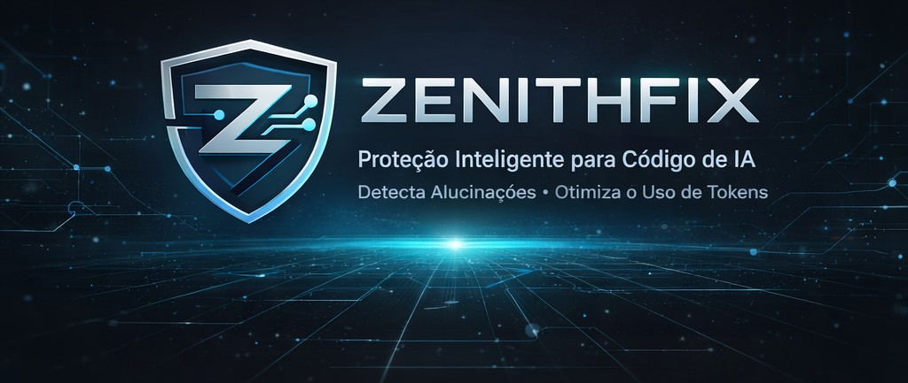

# 🛡️ ZenithFix v1.0

  

### The AI-Debt Antidote: Stop burning tokens and shipping hallucinations.

ZenithFix is an advanced static analysis tool (linter) designed for the Post-AI Coding Era. While LLMs like Copilot, GPT-4, and Cursor help you write code faster, they often introduce hidden costs, security risks, and logical hallucinations.

ZenithFix acts as a security and efficiency guardrail for AI-assisted development.

---

# 🚀 Key Features

## 💎 Efficiency Auditor (Token Bleeding)

Identifies expensive API calls (OpenAI, Anthropic, etc.) placed inside loops or implicit comprehensions.

Impact

Prevents unexpected cloud bills by suggesting batching strategies.

---

## 🧠 Hallucination Detector (Dynamic Introspection)

Uses real-time library inspection to verify if AI-suggested methods actually exist.

Impact

Catches ghost methods in popular libraries like Pandas, OpenAI, and OS before they hit production.

---

## 🔒 Shadow Dependency Scanner

Flags low-reputation or non-standard libraries that AI often invents or suggests.

Impact

Protects your software supply chain from malicious packages and typosquatting.

---

# 📊 Quick Start

## Installation

git clone https://github.com/leoregiesdev/ZenithFix.git  
cd ZenithFix  
pip install -r requirements.txt  

---

## Run an Audit

python src/zenithfix_cli.py ./your_project_path

---

# 🧪 Demo & Stress Test

You can see ZenithFix in action by running the provided demo script:

bash demo.sh

This script demonstrates edge cases such as:

- Hidden loops
- AI hallucinated APIs
- Fake dependencies

---

# 🤖 CI/CD Integration

ZenithFix comes pre-configured with GitHub Actions.

Every push or pull request is automatically audited to ensure code integrity.

---

# 📈 Business ROI

| Metric | Impact |
|------|------|
| Cloud/LLM Costs | Up to 80% reduction via batching detection |
| Security Risk | Blocks AI-suggested malicious packages |
| Dev Efficiency | Prevents hours of debugging hallucinated logic |

---

Built for the next generation of engineers who ship fast, but ship safe.

Developed by Leo Regies.
